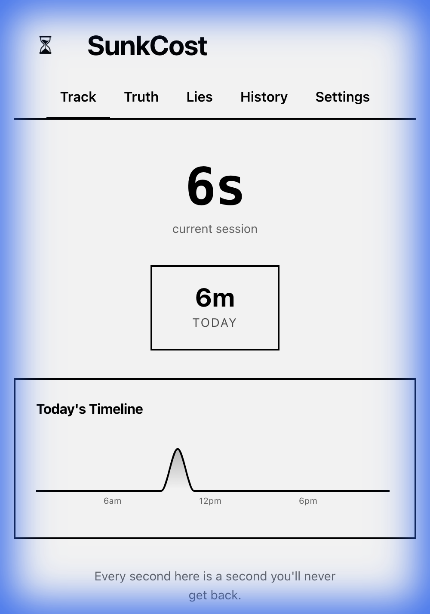
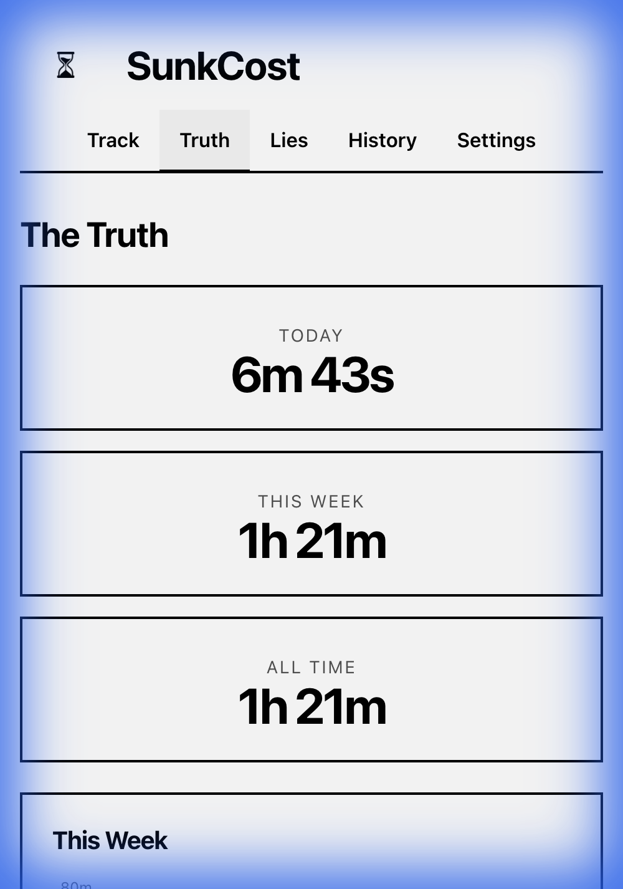
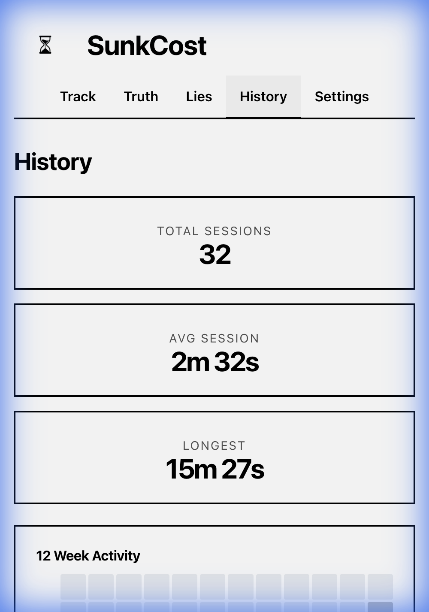
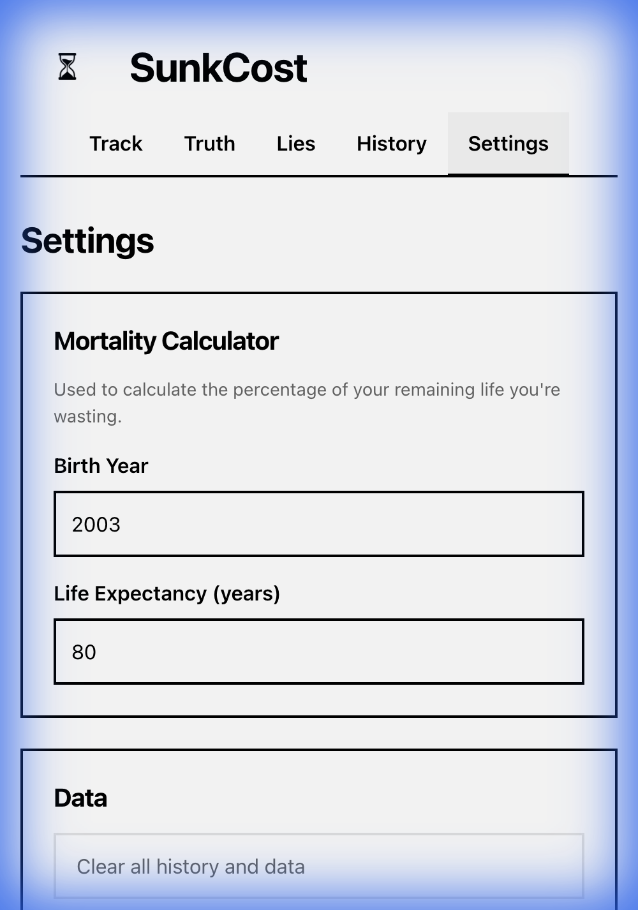

<p align="center">
  
</p>

<h1 align="center">SunkCost</h1>

<p align="center">
  <strong>The brutally honest screen time tracker that shows you what you're really spending.</strong>
</p>

<p align="center">
  <a href="#features">Features</a> •
  <a href="#screenshots">Screenshots</a> •
  <a href="#installation">Installation</a> •
  <a href="#development">Development</a> •
  <a href="#philosophy">Philosophy</a>
</p>

<p align="center">
  
  
  
  
</p>

---

## 🎬 Demo

<p align="center">
  
</p>

---

## 💀 The Uncomfortable Truth

Most screen time apps try to help you "manage" your usage with gamification, achievements, and feel-good streaks.

**SunkCost doesn't.**

Instead, it calculates exactly how much of your remaining life you've spent staring at a screen. No achievements. No streaks. No gamification. Just the raw, uncomfortable truth.

> *"Every second here is a second you'll never get back."*

---

## ✨ Features

### 🕐 Automatic Tracking
- **Zero-click tracking** — Opens the app? You're being tracked. Close it? Session saved.
- **Background tracking** — Minimized or hidden? Still counting. Only Cmd+Q truly stops it.
- **Persistent sessions** — Your data persists across restarts.

### 📊 Mortality Calculator
- Enter your birth year and life expectancy
- See exactly what percentage of your remaining life you've wasted
- Watch the counter tick up in real-time

### 📈 Comprehensive Analytics
- **Today's Timeline** — Hour-by-hour visualization of your usage
- **12-Week Activity Heatmap** — GitHub-style contribution graph for your shame
- **Session History** — Every session recorded with duration and timestamps
- **Lifetime Statistics** — Total sessions, average duration, longest session

### 🎯 Lies You Tell Yourself
- Track the intentions you set ("I'll just check one thing...")
- See how your stated intentions compare to reality
- Confront the gap between what you say and what you do

---

## 📸 Screenshots

<table>
  <tr>
    <td align="center">
      <br>
      <strong>Track</strong><br>
      <em>Real-time session tracking</em>
    </td>
    <td align="center">
      <br>
      <strong>Truth</strong><br>
      <em>The uncomfortable statistics</em>
    </td>
  </tr>
  <tr>
    <td align="center">
      <br>
      <strong>History</strong><br>
      <em>12-week activity heatmap</em>
    </td>
    <td align="center">
      <br>
      <strong>Settings</strong><br>
      <em>Mortality calculator setup</em>
    </td>
  </tr>
</table>

---

## 🚀 Installation

### macOS (Recommended)

1. Download the latest release from the [Releases](https://github.com/colingalbraith/SunkCost/releases) page
2. Open the `.dmg` file
3. Drag SunkCost to your Applications folder
4. Open SunkCost and confront reality

### Build from Source

```bash
# Clone the repository
git clone https://github.com/colingalbraith/SunkCost.git
cd SunkCost/app

# Install dependencies
npm install

# Run in development mode
npm run dev

# Build the desktop app
npm run electron:build
```

---

## 🛠 Development

### Prerequisites

- Node.js 18+
- npm 9+

### Project Structure

```
sunkcost/
├── app/
│   ├── src/
│   │   ├── components/    # React components
│   │   ├── hooks/         # Custom React hooks
│   │   ├── utils/         # Utility functions
│   │   └── types/         # TypeScript types
│   ├── electron/          # Electron main process
│   └── dist/              # Production build
└── assets/                # Screenshots and media
```

### Available Scripts

| Command | Description |
|---------|-------------|
| `npm run dev` | Start development server |
| `npm run build` | Build for web |
| `npm run electron:dev` | Run Electron in dev mode |
| `npm run electron:build` | Build macOS desktop app |

---

## 🧠 Philosophy

SunkCost is built on a simple premise: **awareness precedes change**.

Most productivity apps fail because they:
- Gamify the problem (turning addiction into a game)
- Provide easy outs (skip this session, pause tracking)
- Focus on rewards instead of reality

SunkCost takes a different approach:
- **No gamification** — Your life isn't a game
- **No achievements** — Breathing isn't an accomplishment
- **No escape** — If the app is open, you're being watched
- **Pure honesty** — Just the numbers, no sugarcoating

The goal isn't to make you feel good. It's to make you see clearly.

---

## 🔒 Privacy

- **100% local storage** — All data stays on your device
- **No analytics** — We don't track you tracking yourself
- **No accounts** — No sign-up, no cloud sync, no data collection
- **Open source** — Verify it yourself

---

## 📄 License

MIT © 2024

---

<p align="center">
  <strong>Every second here is a second you'll never get back.</strong>
</p>
